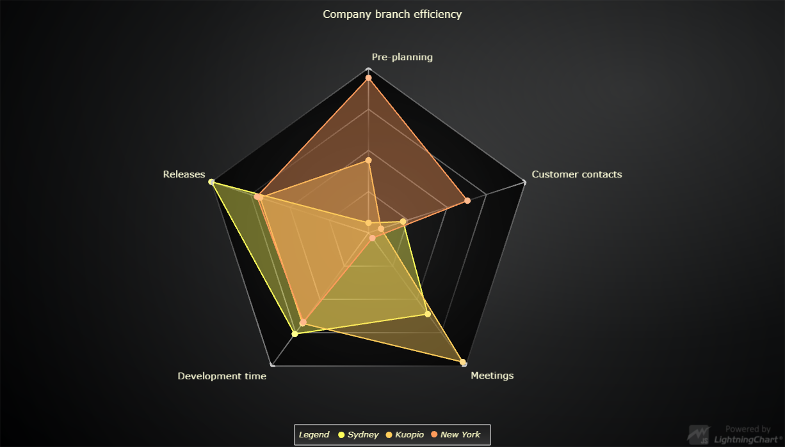

# Spider Static



This demo application belongs to the set of examples for LightningChart JS, data visualization library for JavaScript.

LightningChart JS is entirely GPU accelerated and performance optimized charting library for presenting massive amounts of data. It offers an easy way of creating sophisticated and interactive charts and adding them to your website or web application.

The demo can be used as an example or a seed project. Local execution requires the following steps:

- Make sure that relevant version of [Node.js](https://nodejs.org/en/download/) is installed
- Open the project folder in a terminal:

        npm install              # fetches dependencies
        npm start                # builds an application and starts the development server

- The application is available at *http://localhost:8080* in your browser, webpack-dev-server provides hot reload functionality.


## Description

*Also known as Radar Chart, Web Chart, Polar Chart, Star Series*

This example shows the creation and API of Spider Chart, which is generally used to compare multivariate quantitative data set. Each quantitative variable is represented on a categorical axis starting from the same center point.

Typical usage of the Radar (Spider) chart is to compare various products over a range of characteristics.

Spider Charts are created in a very straight-forward manner:

```javascript
// Add a Spider Chart.
const spiderChart = Spider()
```

Spider Series provides an ability to specify styles for both markers and lines individually.

```javascript
const spiderSeries = spiderChart.addSeries(PointShape.Circle)
    .setName('Positive feedback distribution')
    .setFillStyle(fillStyle)
    .setPointFillStyle(pointFillStyle)
    // etc ...
```

Actual data is added with the format: `{ axis: string, value: number }`, where 'axis' refers to the name of a category.

```javascript
spiderSeries.addPoints(
    // Any number of { axis, value } pairs can be passed.
    { axis: 'Team spirit', value: 55 },
    { axis: 'Premises', value: 27 },
    { axis: 'Salary', value: 25 }
)
```

Adding points with unique tags will automatically create new categorical axes for the Spider Chart in the order of adding (the first axis will always point directly up and following ones will traverse clock-wise). Adding more points to the same category tag in one series will override any previous values.


## API Links

* [Color palettes]
* [Solid FillStyle]
* [Empty LineStyle]
* [Spider chart]
* [Spider series]
* [LegendBox]
* [UI origin positions]


## Support

If you notice an error in the example code, please open an issue on [GitHub][0] repository of the entire example.

Official [API documentation][1] can be found on [Arction][2] website.

If the docs and other materials do not solve your problem as well as implementation help is needed, ask on [StackOverflow][3] (tagged lightningchart).

If you think you found a bug in the LightningChart JavaScript library, please contact support@arction.com.

Direct developer email support can be purchased through a [Support Plan][4] or by contacting sales@arction.com.

[0]: https://github.com/Arction/
[1]: https://www.arction.com/lightningchart-js-api-documentation/
[2]: https://www.arction.com
[3]: https://stackoverflow.com/questions/tagged/lightningchart
[4]: https://www.arction.com/support-services/

© Arction Ltd 2009-2020. All rights reserved.


[Color palettes]: https://www.arction.com/lightningchart-js-api-documentation/v2.2.0/globals.html#colorpalettes
[Solid FillStyle]: https://www.arction.com/lightningchart-js-api-documentation/v2.2.0/classes/solidfill.html
[Empty LineStyle]: https://www.arction.com/lightningchart-js-api-documentation/v2.2.0/globals.html#emptyline
[Spider chart]: https://www.arction.com/lightningchart-js-api-documentation/v2.2.0/classes/spiderchart.html
[Spider series]: https://www.arction.com/lightningchart-js-api-documentation/v2.2.0/classes/spiderseries.html
[LegendBox]: https://www.arction.com/lightningchart-js-api-documentation/v2.2.0/classes/chartxy.html#addlegendbox
[UI origin positions]: https://www.arction.com/lightningchart-js-api-documentation/v2.2.0/globals.html#uiorigins

